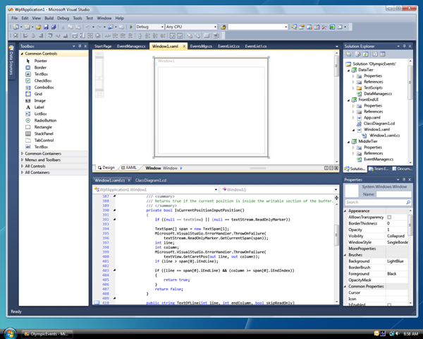

#集成开发环境(IDE)

当安装好python之后，其实就已经可以进行开发了。下面我们开始写第一行python代码。

##值得纪念的时刻：Hello world

如果是用windows，请打开CMD，并执行python。

如果是UNIX类的，就运行shell，并执行python。

都会出现如下内容：

    Python 2.7.6 (default, Nov 13 2013, 19:24:16) 
    [GCC 4.6.3] on linux2
    Type "help", "copyright", "credits" or "license" for more information.
    >>>

在>>>后面输入下面内容，并按回车。这就是见证奇迹的时刻。从这一刻开始，一个从来不懂编程的你，就跨入了程序员行列，不管你的工作是不是编程，你都已经是程序员了，其标志就是你已经用代码向这个世界打招呼了。

    >>> print "Hello, World"
    Hello, World

每个程序员，都曾经经历过这个伟大时刻，不经历这个伟大时刻的程序员不是伟大的程序员。为了纪念这个伟大时刻，理解其伟大之所在，下面执行分解动作：

>>说明：在下面的分解动作中，用到了一个符号：#，就是键盘上数字３上面的那个井号，通过按下shift，然后按3，就得到了。这个符号，在python编程中，表示注释。所谓注释，就是在计算机不执行，只是为了说明某行语句表达什么意思。

    #看到“>>>”符号，表示python做好了准备，当代你向她发出指令，让她做什么事情
    >>>

    #print，意思是打印。在这里也是这个意思，是要求python打印什么东西
    >>> print

    #"Hello,World"是打印的内容，注意，量变的双引号，都是英文状态下的。引号不是打印内容，它相当于一个包裹，把打印的内容包起来，统一交给python。
    >>> print "Hello, World"  
    
    #上面命令执行的结果。python接收到你要求她所做的事情：打印Hello,World，于是她就老老实实地执行这个命令，丝毫不走样。
    Hello, World
    
祝贺，伟大的程序员。

>>笑一笑：有一个程序员，自己感觉书法太烂了，于是立志继承光荣文化传统，购买了笔墨纸砚。在某天，开始练字。将纸铺好，拿起笔蘸足墨水，挥毫在纸上写下了两个打字：Hello World

从此，进入了程序员行列，但是，看官有没有感觉，程序员用的这个工具，就是刚才打印Hello,World的那个cmd或者shell，是不是太简陋了？你看美工妹妹用的Photoshop，行政妹妹用的word，出纳妹妹用的Excle，就连坐在老板桌后面的那个家伙还用一个PPT播放自己都不相信的新理念呢，难道我们伟大的程序员，就用这么简陋的工具写出旷世代码吗？

当然不是。软件是谁开发的？程序员。程序员肯定会先为自己打造好用的工具，这也叫做近水楼台先得月。

IDE就是程序员的工具。

##集成开发环境

IDE的全称是：Integrated Development Environment，简称IDE，也稱為Integration Design Environment、Integration Debugging Environment，翻译成中文叫做“集成开发环境”，在台湾那边叫做“整合開發環境”。它是一種輔助程式開發人員開發軟體的應用軟體。

下面就直接抄[维基百科上的说明了](http://zh.wikipedia.org/zh/%E9%9B%86%E6%88%90%E5%BC%80%E5%8F%91%E7%8E%AF%E5%A2%83)：

>>IDE通常包括程式語言編輯器、自動建立工具、通常還包括除錯器。有些IDE包含編譯器／直譯器，如微软的Microsoft Visual Studio，有些则不包含，如Eclipse、SharpDevelop等，这些IDE是通过调用第三方编译器来实现代码的编译工作的。有時IDE還會包含版本控制系統和一些可以設計圖形用戶界面的工具。許多支援物件導向的現代化IDE還包括了類別瀏覽器、物件檢視器、物件結構圖。雖然目前有一些IDE支援多種程式語言（例如Eclipse、NetBeans、Microsoft Visual Studio），但是一般而言，IDE主要還是針對特定的程式語言而量身打造（例如Visual Basic）。

看不懂，没关系，看图，认识一下，混个脸熟就好了。所谓有图有真相。

上面的图显示的是微软的提供的名字叫做Microsoft Visual Studio的IDE。用C#进行编程的程序员都用它。

上图是在苹果电脑中出现的名叫XCode的IDE。

要想了解更多IDE的信息，推荐阅读维基百科中的词条

- 英文词条：[Integrated development environment](http://en.wikipedia.org/wiki/Integrated_development_environment)
- 中文词条：[集成开发环境](http://zh.wikipedia.org/zh/%E9%9B%86%E6%88%90%E5%BC%80%E5%8F%91%E7%8E%AF%E5%A2%83)

##Python的IDE

google一下：python IDE，会发现，能够进行python编程的IDE还真的不少。东西一多，就开始无所适从了。所有，有不少人都问用哪个IDE好。可以看看[这个提问，还列出了众多IDE的比较](http://stackoverflow.com/questions/81584/what-ide-to-use-for-python)。

>>顺便向列位看客推荐一个非常好的开发相关网站：[stackoverflow.com](http://stackoverflow.com/)
>>在这里可以提问，可以查看答案。一般如果有问题，先在这里查找，多能找到非常满意的结果，至少有很大启发。
>>在某国有时候有地方可能不能访问，需要科学上网。好东西，一定不会让你容易得到，也不会让任何人都得到。

那么做为零基础的学习者，用什么好呢？

既然是零基础，就别瞎折腾了，就用Python自带的IDLE。原因就是：简单。

Windows的朋友操作：“开始”菜单->“所有程序”->“Python 2.x”->“IDLE（Python GUI）”来启动IDLE。启动之后，大概看到这样一个图

注意：看官所看到的界面中显示版本跟这个图不同，因为安装的版本区别。大致模样差不多。

其它操作系统的用户，也都能在找到idle这个程序，启动之后，跟上面一样的图。

后面我们所有的编程，就在这里完成了。这就是伟大程序员用的第一个IDE。

磨刀不误砍柴工。IDE已经有了，伟大程序员就要开始从事伟大的编程工作了。且看下回分解。

