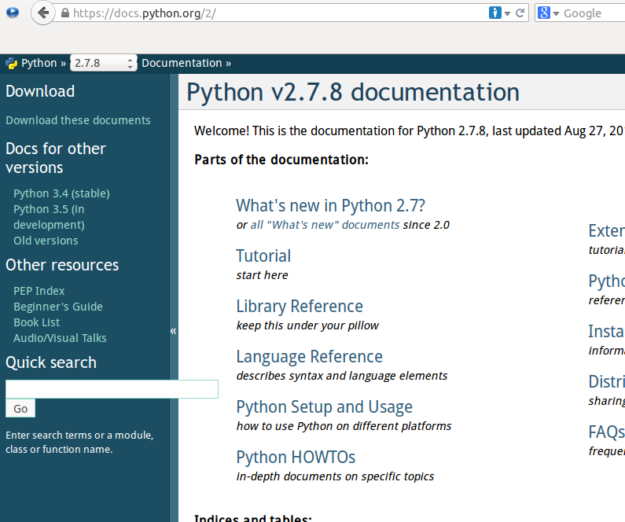

#Python文档

文档，这个词语在经常在程序员的嘴里冒出来，有时候他们还经常以文档有没有或者全不全为标准来衡量一个软件项目是否高大上。那么，软件中的文档是什么呢？有什么要求呢？python文档又是什么呢？文档有什么用呢？

文档很重要。独孤九剑的剑诀、易筋经的心法、写着辟邪剑谱的袈裟，这些都是文档。连那些大牛人都要这些文档，更何况我们呢？所以，文档是很重要的。

文档，说白了就是用word（这个最多了）等（注意这里的等，把不常用的工具都等掉了，包括我编辑文本时用的vim工具）文本编写工具写成的包含文本内容但不限于文字的文件。有点啰嗦，啰嗦的目的是为了严谨，呵呵。最好还是来一个更让人信服的定义，当然是来自[维基百科](http://zh.wikipedia.org/wiki/%E8%BD%AF%E4%BB%B6%E6%96%87%E6%A1%A3)。

>软件文档或者源代码文档是指与软件系统及其软件工程过程有关联的文本实体。文档的类型包括软件需求文档，设计文档，测试文档，用户手册等。其中的需求文档，设计文档和测试文档一般是在软件开发过程中由开发者写就的，而用户手册等非过程类文档是由专门的非技术类写作人员写就的。

>早期的软件文档主要指的是用户手册，根据Barker的定义，文档是用来对软件系统界面元素的设计、规划和实现过程的记录，以此来增强系统的可用性。而Forward则认为软件文档是被软件工程师之间用作沟通交流的一种方式，沟通的信息主要是有关所开发的软件系统。Parnas则强调文档的权威性，他认为文档应该提供对软件系统的精确描述。

>综上，我们可以将软件文档定义为：

>1.文档是一种对软件系统的书面描述；
>2.文档应当精确地描述软件系统；
>3.软件文档是软件工程师之间用作沟通交流的一种方式；
>4.文档的类型有很多种，包括软件需求文档，设计文档，测试文档，用户手册等；
>5.文档的呈现方式有很多种，可以是传统的书面文字形式或图表形式，也可是动态的网页形式

那么这里说的Python文档指的是什么呢？一个方面就是每个学习者要学习python，python的开发者们（他们都是大牛）给我们这些小白提供了什么东西没有？能够让我们给他们这些大牛沟通，理解python中每个函数、指令等的含义和用法呢？

有。大牛就是大牛，他们准备了，而且还不止一个。

##查看python文档

真诚的敬告所有看本教程的诸位，要想获得编程上的升华，看文档是必须的。文档胜过了所有的教程和所有的老师以及所有的大牛。为什么呢？其中原因，都要等待看官看懂了之后，有了体会感悟之后才能明白。

python文档的网址：[https://docs.python.org/2/](https://docs.python.org/2/)，这是python2.x，从这里也可以找到python3.x的文档。

除了看网站上的文档，还有别的方式吗？

有，而且看官并不陌生，此前已经在本教程中多次用到，那就是dir()和help()

    >>> dir(list)
    ['__add__', '__class__', '__contains__', '__delattr__', '__delitem__', '__delslice__', '__doc__', '__eq__', '__format__', '__ge__', '__getattribute__', '__getitem__', '__getslice__', '__gt__', '__hash__', '__iadd__', '__imul__', '__init__', '__iter__', '__le__', '__len__', '__lt__', '__mul__', '__ne__', '__new__', '__reduce__', '__reduce_ex__', '__repr__', '__reversed__', '__rmul__', '__setattr__', '__setitem__', '__setslice__', '__sizeof__', '__str__', '__subclasshook__', 'append', 'count', 'extend', 'index', 'insert', 'pop', 'remove', 'reverse', 'sort']

    >>> help(list.__mul__)

    Help on wrapper_descriptor:

    __mul__(...)
        x.__mul__(n) <==> x*n

这种查看文档的方式，在交互模式下经常用到，快捷方便，请看官务必牢记并使用。

正如前面已经介绍过的，还有一个文档：__doc__,help调用的其实就是这个函数里面的内容。

    >>> print(list.__mul__.__doc__)     #与help(list.__mul__)显示的内容一致
    x.__mul__(n) <==> x*n
    
    >>> print(list.index.__doc__)       #查看index的文档
    L.index(value, [start, [stop]]) -> integer -- return first index of value.
    Raises ValueError if the value is not present.
    
##给自己的程序加上文档

在自己编写程序的时候，也非常希望能够有类似上面查看python文档的功能，可以通过某种方式查看自己的程序文档，这样显得自己多牛呀。

有一种方法可以实现，就是在你所编写的程序中用三个双引号或者单引号成对地出现，中间写上有关文档内容。

    >>> def qiwsir():
    ...     """I like python"""
    ...     print "http://qiwsir.github.io"
    ... 
    >>> qiwsir()
    http://qiwsir.github.io
    
    >>> print(qiwsir.__doc__)   #用这种方法可以看自己写的函数中的文档
    I like python

    >>> help(qiwsir)            #其实就是调用__doc__显示的内容

    Help on function qiwsir in module __main__:

    qiwsir()
        I like python

另外，对于一个文件，可以把有关说明放在文件的前面，不影响该文件代码运行。

例如，有这样一个扩展名是.py的python文件，其内容是：

	#!/usr/bin/env python
	#coding:utf-8
	
	import random
	
	number = random.randint(1,100)
	
	guess = 0
	
	while True:
	
	    num_input = raw_input("please input one integer that is in 1 to 100:")
	    guess +=1
	
	    if not num_input.isdigit():
	        print "Please input interger."
	    elif int(num_input)<0 and int(num_input)>=100:
	        print "The number should be in 1 to 100."
	    else:
	        if number==int(num_input):
	            print "OK, you are good.It is only %d, then you successed."%guess
	            break
	        elif number>int(num_input):
	            print "your number is more less."
	        elif number<int(num_input):
	            print "your number is bigger."
	        else:
	            print "There is something bad, I will not work"

这段程序，就是在[《用while来循环》](./205.md)中用到的一个猜数字的游戏，它存储在名为205-2.py的文件中，如果要对这段程序写一个文档，就可以这么做。

    """
       This is a game.
       I am Qiwei.
       I like python.
       I am writing python articles in my website.
       My website is http://qiwsir.github.io
       You can learn python free in it.
    """

	#!/usr/bin/env python
	#coding:utf-8
	
	import random
	
	number = random.randint(1,100)
	
	guess = 0
	
	while True:
	
	    num_input = raw_input("please input one integer that is in 1 to 100:")
	    guess +=1
	
	    if not num_input.isdigit():
	        print "Please input interger."
	    elif int(num_input)<0 and int(num_input)>=100:
	        print "The number should be in 1 to 100."
	    else:
	        if number==int(num_input):
	            print "OK, you are good.It is only %d, then you successed."%guess
	            break
	        elif number>int(num_input):
	            print "your number is more less."
	        elif number<int(num_input):
	            print "your number is bigger."
	        else:
	            print "There is something bad, I will not work"

最后，推荐一片相当相当好的文章，与列位分享：

[Python 自省指南:如何监视您的 Python 对象](http://www.ibm.com/developerworks/cn/linux/l-pyint/#ibm-pcon)
