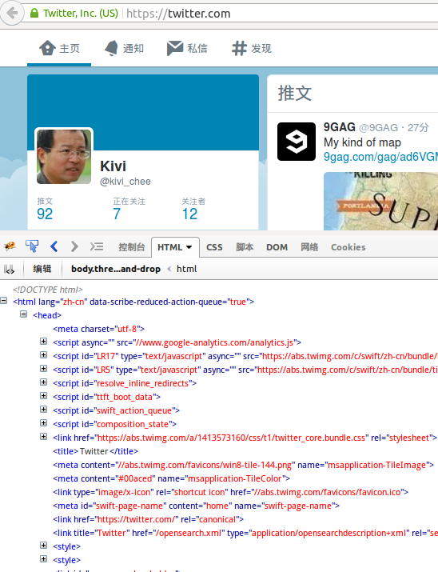

#静态文件

在网上浏览网页，由于现在网速也快了，大概你很少注意网页中那些所谓的静态文件。怎么找出来静态文件呢？

如果使用firefox(我特别向列位推荐这个浏览器，它是我认为的最好的浏览器，没有之一。哈哈。“你信不信？反正我信了。”)，可以通过firebug组件，来研究网页的代码，当然，你直接看源码也行。

上图中，我打开了一个对天朝很多人来说不存在的网站，并且通过Firebug查看其源码，打开`<head>`，发现里面有不少`<script`和`<link`开始引入的文件，这些文件一部分是javascript文件，一部分是css文件。在一个网站中，这类文件一般是不会发生变化的，也就是它的内容稳定，直到下次文件管理员或者有权限的人修改时。而网站程序本身一般不会修改它们。因此将他们称之为**静态文件**。

此外，网站中的**静态文件**还包括一些图片，比如logo，以及做为边框的图片等。

在tornado中，有专门方法处理这些静态文件。

##静态路径

看官是否还记得在前面写过这个模样的代码：`template_path=os.path.join(os.path.dirname(__file__), "templates")`，这里是设置了模板的路径，放置模板的目录名称是`templates`。类似的方法，我们也可以设置好静态文件的路径。

    static_path=os.path.join(os.path.dirname(__file__), "static")
    
这里的设置，就是将所有的静态文件，放在了`static`目录中。

这样就设置了静态路径。

下面的代码是将[上一节](./312.md)的代码进行了改写，注意变化的地方

    #! /usr/bin/env python
    #-*- coding:utf-8 -*-

    import os.path
    import tornado.httpserver
    import tornado.ioloop
    import tornado.web
    import tornado.options

    from tornado.options import define, options
    define("port", default=8000, help="run on the given port", type=int)

    class IndexHandler(tornado.web.RequestHandler):
        def get(self):
            lst = ["python","www.itdiffer.com","qiwsir@gmail.com"]
            self.render("index.html", info=lst)

    handlers = [(r"/", IndexHandler),]

    template_path = os.path.join(os.path.dirname(__file__), "temploop")
    static_path = os.path.join(os.paht.dirname(__file__), "static")    #这里增加设置了静态路径

    if __name__ == "__main__":
        tornado.options.parse_command_line()
        app = tornado.web.Application(handlers, template_path, static_path, debug=True)   #这里也多了点
        http_server = tornado.httpserver.HTTPServer(app)
        http_server.listen(options.port)
        tornado.ioloop.IOLoop.instance().start()

上面的代码比前一讲中，多了两处，一处是定义了静态文件路径`static_path`，在这里将存储静态文件的目录命名为`static`。另外一个修改就是在实例化`tornado.web.Application()`的时候，在参数中，出了有静态路径参数`static_path`，还有一个参数设置`debug=True`，这个参数设置的含义是当前的tornado服务器可以不用重启，就能够体现已经修改的代码功能。回想一下，在前面进行调试的时候，是不是每次如果修改了代码，就得重启tornado服务器，才能看到修改效果。用了这个参数就不用这么麻烦了。

特别说着，`debug=True`仅仅用于开发的调试过程中，如果在生产部署的时候，就不要这么使用了。

##编写模板文件

我们设置静态路径的目的就是要在模板中引入css和js等类型的文件以及图片等等。那么如何引入呢，下面以css为例说明。

在一般网页的`<head>...</head>`部分，都会引入CSS，例如下面的写法不少网站都愿意引用google的字体库，样式如下：

    <link href='http://fonts.googleapis.com/css?family=Open+Sans:300,400,600&subset=latin,latin-ext' rel='stylesheet'>

这就是CSS的引入。

但是，如果看官在墙内也这么引入字体库，希望自己的网页上能使用，那就有点麻烦了，因为google的这个项目已经不行被墙，如果在网页中写了上面代码，会导致网页打开速度很慢，有的甚至出错。

怎么办？那就不用啦。不过，国内有好心网站做了整个谷歌字体的代理，可以用下面方式，墙里面就不怕了。

    <link href='http://fonts.useso.com/css?family=Open+Sans:300,400,600&subset=latin,latin-ext' rel='stylesheet'>

顺便提供一个墙内的常用前端库地址：http://libs.useso.com/，供看官参考使用。

那么如果我自己写CSS呢？并且按照前面的设定，已经将该CSS文件放在了static目录里面，命名为style.css，就可以这样引入

    <link href="/static/style.css" rel="stylesheet">

但是，这里往往会有一个不方便的地方，如果我手闲着无聊，或者因为别的充足理由，将存储静态文件的目录static换成了sta，并且假设我已经在好几个模板中都已经写了上面的代码。接下来我就要把这些文件全打开，一个一个更改`<link>`里面的地址。

请牢记，凡是遇到重复的事情，一定要找一个函数方法解决。tornado就提供了这么一个：`static_url()`,把上面的代码写成：

    <link href="{{ static_url("style.css") }}" rel="stylesheet" >

这样，就不管你如何修改静态路径，模板中的设置可以不用变。

按照这个引入再修改相应的模板文件。
